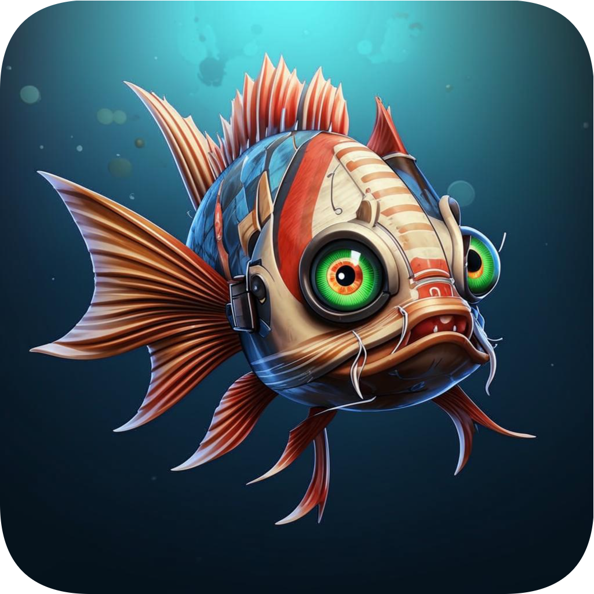

<div align="center">
  
  <h1 align="center"><b>Lophius</b></h1>
  <p align="center">🏭 Система автоматизации сбора, отслеживания, коллекционирования медиа и многого другого.</p>
</div>

<br>

<p align="center">
  <a href="./"></a>
</p>

<p align="center">
  <a href="http://www.gnu.org/licenses/agpl-3.0" rel="nofollow"></a>
  <a href="./"></a>
  <a href="./"></a>
</p>

<p align="center">
  <a href="https://lophius.zmln.ru">Demo</a>
  <span>&nbsp;•&nbsp;</span>
  <a href="#run-locally">Run Locally</a>
  <span>&nbsp;•&nbsp;</span>
  <a href="#authors">Authors</a>
  <span>&nbsp;•&nbsp;</span>
  <a href="#roadmap">Roadmap</a>
</p>

## Demo

Демо-версию можно просмотреть по адресу [lophius.zmln.ru](https://lophius.zmln.ru)


## Run Locally

1. Клонируйте репозиторий

```bash
  git clone https://github.com/zamelane/lophius
```

2. Перейдите в директорию с проектом сервер

```bash
  cd lophius/apps/web-server
```

3. Установите зависимости

```bash
  bun i
```

4. Заполните конфигурационный файл `.env` (пример заполнения см. в файле `.env.example`)

5. Соберите и запустите сервер (production)

```bash
  bun run build
  bun start
```


## Authors

- [@zamelane](https://www.github.com/zamelane)


## Roadmap

Планы по разработке проекта (поэтапно):

- Реализовать ручные редакторы медиа

- Интегрировать внешние сервисы для извлечения метаданных

- Реализовать создание коллекций и списков

- Добавить возможность отслеживания медиа (получение уведомлений)

- Интегрировать календарь выхода медиа

- Рефакторинг
